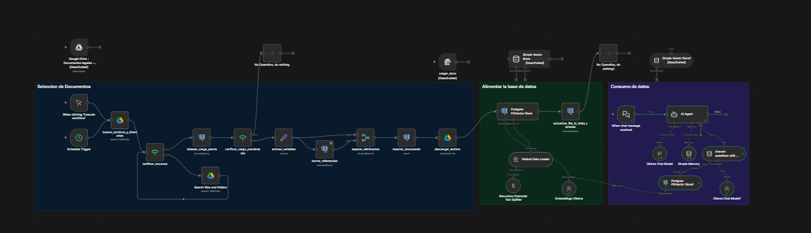
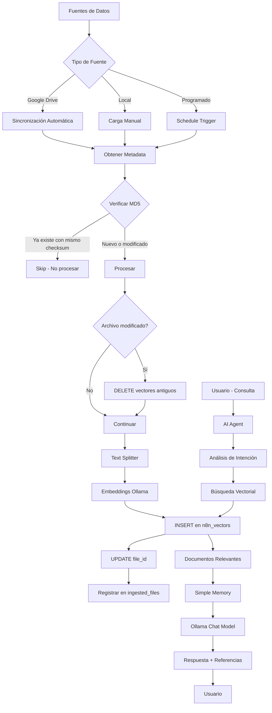

# Sistema RAG para Asistente Legal - Versión 2.0



## 📋 Descripción General

Este proyecto implementa un sistema de **RAG (Retrieval-Augmented Generation)** versión 2.0, diseñado para asistir a abogados en la consulta eficiente de documentos legales. El sistema combina búsqueda semántica en documentos con capacidades de generación de respuestas mediante inteligencia artificial, con mejoras significativas en la arquitectura y flujo de procesamiento.

## 🆕 Novedades de la Versión 2.0

- ✨ **Arquitectura modular mejorada**: Separación clara entre ingesta y consulta
- 🔄 **Sistema de deduplicación inteligente**: Evita reprocesar archivos sin cambios usando MD5 checksums
- 📦 **Procesamiento de documentos optimizado**: Múltiples fuentes de carga
- 🧠 **Sistema de embeddings mejorado**: Mejor representación semántica
- 💾 **Gestión de memoria conversacional**: Contexto persistente entre consultas
- 🎯 **Pipeline de procesamiento refinado**: Flujo más eficiente y escalable

### ¿Por qué Deduplicación?

Sin el sistema de deduplicación, cada vez que se ejecuta el workflow (manual o schedule):
- ❌ Se reprocesarían **todos** los archivos aunque no hayan cambiado
- ❌ Se duplicarían vectores en la base de datos
- ❌ Costo computacional innecesario (embeddings son costosos)
- ❌ Base de datos llena de datos redundantes

Con deduplicación usando `md5_checksum`:
- ✅ Solo se procesan archivos nuevos o modificados
- ✅ No hay duplicados en la base de vectores
- ✅ Ahorro de tiempo y recursos
- ✅ Base de datos limpia y eficiente

## 🤖 ¿Qué es RAG?

**RAG (Retrieval-Augmented Generation)** es una arquitectura de IA que combina dos componentes principales:

1. **Retrieval (Recuperación)**: Búsqueda de información relevante en una base de conocimientos
2. **Generation (Generación)**: Generación de respuestas contextualizadas basadas en la información recuperada

Esta arquitectura permite que el modelo de IA acceda a información actualizada y específica del dominio sin necesidad de reentrenamiento, garantizando respuestas precisas y fundamentadas en fuentes verificables.

## 🏗️ Arquitectura del Sistema v2

### 1. Selección de Documentos (Ingesta) - Panel Izquierdo

El flujo de procesamiento de documentos ha sido optimizado con múltiples puntos de entrada y un **sistema de deduplicación inteligente**:

```
Google Drive + Selector de Archivos + Schedule Trigger
    ↓
[obtener_contrato_laboral + conflicto_resolución + Search files and folders]
    ↓
Verificación MD5 Checksum (ingested_files)
    ↓
    ├─ Archivo nuevo/modificado → Procesar
    └─ Archivo ya procesado → Skip
    ↓
Embeddings Ollama
    ↓
Vector Store Manager → n8n_vectors
```

**Componentes de Ingesta:**

- **Google Drive**: Integración directa con Google Drive para documentos almacenados en la nube
- **Selector de Archivos**: Carga manual de documentos desde sistema local
- **Schedule Trigger**: Actualización automática periódica de documentos
- **obtener_contrato_laboral**: Módulo especializado para obtención de contratos laborales
- **conflicto_resolución**: Sistema de deduplicación que:
  - Verifica si el archivo existe en `ingested_files`
  - Compara el `md5_checksum` actual vs el guardado
  - Elimina vectores antiguos si el archivo cambió
  - Actualiza la tabla `ingested_files` después de procesar
- **Search files and folders**: Búsqueda y organización de archivos
- **Embeddings Ollama**: Conversión de texto a vectores semánticos
- **Vector Store Manager**: Gestión centralizada del almacenamiento vectorial

### Flujo de Deduplicación

1. **Check**: Se consulta `ingested_files` con el `file_id` y `md5_checksum`
2. **Decision**: 
   - Si `count(*) > 0`: El archivo ya está procesado con el mismo contenido → **Skip**
   - Si `count(*) = 0`: Es nuevo o fue modificado → **Procesar**
3. **Clean**: Si fue modificado, se eliminan los vectores antiguos con `DELETE FROM n8n_vectors WHERE file_id = ...`
4. **Process**: Se generan embeddings y se insertan nuevos vectores
5. **Update**: Se actualiza el `file_id` en los vectores recién insertados
6. **Register**: Se guarda/actualiza el registro en `ingested_files`

### 2. Alimentar la Base de Datos - Panel Central

El panel central muestra el procesamiento y almacenamiento:

```
Document Sources → Default Data Loader → Text Splitter
    ↓
Embeddings Ollama
    ↓
Insert Documents
    ↓
Vector Store (Postgres)
```

**Componentes:**

- **Default Data Loader**: Carga y parseo inteligente de documentos
- **Text Splitter**: División optimizada de documentos en chunks coherentes
- **Embeddings Ollama**: Generación de representaciones vectoriales
- **Insert Documents**: Inserción eficiente en base de datos
- **Vector Store (Postgres)**: Almacenamiento persistente en PostgreSQL con soporte vectorial

### 3. Consumo de Datos (Consulta) - Panel Derecho

El flujo de consulta ha sido rediseñado para mayor eficiencia:

```
When chat message received → AI Agent
    ↓
[Ollama Chat Model + Simple Memory + Retrieve Documents (Simple Vector Store)]
    ↓
Response
```

**Componentes de Consulta:**

- **When chat message received**: Trigger de inicio de consulta
- **AI Agent**: Orquestador inteligente mejorado
- **Ollama Chat Model**: Modelo de lenguaje para generación de respuestas
- **Simple Memory**: Gestión de contexto conversacional
- **Retrieve Documents**: Recuperación optimizada de documentos relevantes
- **Simple Vector Store**: Búsqueda semántica de alta velocidad
- **Ollama Chat Model (output)**: Generación final de respuesta

## 📁 Estructura de Documentos

El sistema procesa los siguientes tipos de documentos legales:

### 📂 acuerdos/
- `acuerdo_confidencialidad_ficticio.pdf`

### 📂 contrato-laboral/
- `contrato_laboral_administrativo.pdf`
- `contrato_laboral_gerente.pdf`
- `contrato_laboral_ingeniero.pdf`
- `contrato_laboral_proyecto.pdf`
- `contrato_laboral_ventas.pdf`

### 📂 contratos/
- `contrato_arrendamiento_ficticio.pdf`
- `contrato_compra_venta_ficticio.pdf`
- `contrato_compra_venta_propiedades.pdf`
- `contrato_internacional_suministro.pdf`
- `contrato_joint_venture.pdf`
- `contrato_laboral_ficticio.pdf`
- `contrato_prestamo_ficticio.pdf`
- `contrato_servicios_ficticio.pdf`

### 📂 actas/
- Documentos de actas y resoluciones

### 📂 otros/
- Documentos complementarios

## 🔄 Funcionamiento del Sistema RAG v2

### Proceso de Ingesta Mejorado

1. **Fuentes Múltiples**: Los documentos pueden provenir de:
   - Google Drive (sincronización automática)
   - Carga manual mediante selector de archivos
   - Actualización programada mediante Schedule Trigger

2. **Procesamiento Inteligente**: 
   - Detección automática de tipo de documento
   - Resolución de conflictos en actualizaciones
   - Organización jerárquica de archivos

3. **Vectorización Optimizada**:
   - Generación de embeddings con Ollama
   - Almacenamiento en PostgreSQL con índices vectoriales
   - Gestión eficiente de actualizaciones

### Proceso de Consulta Mejorado

1. **Recepción**: El usuario hace una pregunta sobre documentos legales
2. **Análisis de Intención**: El AI Agent analiza la consulta y determina la estrategia de búsqueda
3. **Recuperación Contextual**: Se utilizan los embeddings para encontrar documentos relevantes
4. **Memoria Conversacional**: Se integra el contexto de la conversación previa
5. **Generación con Contexto**: El modelo genera respuestas basadas en:
   - Documentos recuperados
   - Historial de conversación
   - Instrucciones del sistema
6. **Respuesta Estructurada**: Se entrega la respuesta con referencias y metadatos

### Diagrama de Flujo v2



## ✨ Mejoras de la Versión 2.0

### Ingesta de Documentos
- ✅ **Múltiples fuentes**: Google Drive, local, programado
- ✅ **Actualización automática**: Sincronización periódica
- ✅ **Resolución de conflictos**: Manejo inteligente de duplicados
- ✅ **Organización jerárquica**: Estructura de carpetas optimizada

### Procesamiento
- ✅ **Vector Store en PostgreSQL**: Mayor rendimiento y escalabilidad
- ✅ **Embeddings mejorados**: Representación semántica más precisa
- ✅ **Pipeline optimizado**: Flujo de datos más eficiente

### Consultas
- ✅ **Memoria conversacional**: Contexto persistente entre preguntas
- ✅ **AI Agent mejorado**: Mejor comprensión de intenciones
- ✅ **Recuperación optimizada**: Búsquedas más rápidas y precisas

## 🎯 Características del Asistente

El asistente legal está configurado con las siguientes características:

- 🎯 **Respuestas cortas y puntuales**: Información concisa y directa
- 📚 **Fundamentación documental**: Cada respuesta cita su fuente
- ⚖️ **Tono profesional**: Lenguaje formal apropiado para contexto legal
- 🔒 **Confidencialidad**: Responde únicamente con información de documentos autorizados
- ✋ **Transparencia**: Indica cuando no dispone de información
- 💬 **Memoria conversacional**: Mantiene contexto de consultas previas
- 🔍 **Búsqueda inteligente**: Comprende intenciones y contexto

## 💡 Casos de Uso

- 📄 Consulta rápida de cláusulas específicas en contratos
- 🔍 Análisis comparativo entre documentos similares
- ✔️ Verificación de términos y condiciones
- 📊 Búsqueda de precedentes en acuerdos anteriores
- 👁️ Asistencia en revisión de documentos legales
- ⚡ Respuestas rápidas durante reuniones con clientes
- 📝 Preparación de informes basados en documentación existente
- 🔄 Seguimiento de conversaciones complejas con múltiples consultas
- 📤 Sincronización automática de documentos desde Google Drive

## 🛠️ Tecnologías Utilizadas

### Base de Datos y Almacenamiento
- **PostgreSQL**: Base de datos principal con soporte vectorial
- **Vector Store Manager**: Gestión avanzada de embeddings
- **Google Drive API**: Integración para sincronización de documentos

### Procesamiento de Lenguaje Natural
- **Ollama**: Modelo de lenguaje local para generación y embeddings
- **Text Splitter**: Procesamiento inteligente de documentos largos
- **Embeddings Model**: Representación vectorial semántica

### Orquestación
- **AI Agent**: Orquestador inteligente de flujos
- **Schedule Trigger**: Automatización de tareas periódicas
- **Memory Management**: Gestión de contexto conversacional

### Integración
- **File Selector**: Interfaz de carga de archivos
- **Document Loader**: Procesamiento multi-formato
- **Conflict Resolution**: Manejo de actualizaciones

## 📝 Ejemplo de Interacción v2

**Usuario:**
> ¿Cuál es el procedimiento de terminación anticipada del contrato de arrendamiento?

**Asistente:**
> Según el Contrato de Arrendamiento – Cláusula 12, el contrato puede ser terminado 
> anticipadamente por cualquiera de las partes notificando con al menos 30 días de 
> antelación y cumpliendo con el pago proporcional de las obligaciones pendientes.
>
> **Referencia:** `contrato_arrendamiento_ficticio.pdf`, Cláusula 12
> **Última actualización:** 02/02/2026

---

**Usuario:**
> ¿Y si el arrendatario incumple con el pago?

**Asistente:**
> Recordando nuestra conversación anterior sobre la terminación del contrato de arrendamiento,
> en caso de incumplimiento de pago por parte del arrendatario, la Cláusula 15 establece que
> el arrendador puede rescindir el contrato inmediatamente después de 15 días de mora, previa
> notificación escrita.
>
> **Referencia:** `contrato_arrendamiento_ficticio.pdf`, Cláusula 15

---

## 🚀 Instalación y Configuración v2

### Prerequisitos

- PostgreSQL 14+ con extensión pgvector
- Ollama instalado y ejecutándose
- Python 3.9+
- Node.js 18+ (para n8n)
- Cuenta de Google Cloud (para integración con Google Drive)

### Pasos de Instalación

1. **Clonar el repositorio:**
```bash
git clone https://github.com/tu-usuario/sistema-rag-legal-v2.git
cd sistema-rag-legal-v2
```

2. **Configurar PostgreSQL con pgvector:**
```bash
# Instalar extensión pgvector
sudo apt-get install postgresql-14-pgvector

# Crear base de datos
createdb rag_legal

# Habilitar extensión
psql rag_legal -c "CREATE EXTENSION vector;"
```

3. **Instalar dependencias:**
```bash
npm install -g n8n
pip install -r requirements.txt
```

4. **Configurar Ollama:**
```bash
ollama pull llama2  # o el modelo de tu preferencia
ollama pull nomic-embed-text  # para embeddings
```

5. **Configurar Google Drive API:**
```bash
# Seguir la documentación de Google Cloud para obtener credenciales
# Guardar credenciales en: ./config/google-credentials.json
```

6. **Configurar variables de entorno:**
```bash
cp .env.example .env
# Editar .env con tus configuraciones
```

7. **Importar workflows de n8n:**
```bash
n8n import:workflow --input=./workflows/sistema-rag-v2.json
```

8. **Cargar documentos:**
```bash
# Opción 1: Sincronizar desde Google Drive (automático)
# Opción 2: Copiar documentos localmente
cp -r tus-documentos/* ./documentos/
```

9. **Iniciar servicios:**
```bash
# Terminal 1: Ollama
ollama serve

# Terminal 2: n8n
n8n start

# Terminal 3: PostgreSQL (si no está como servicio)
sudo service postgresql start
```

## 📊 Configuración del Schedule Trigger

Para mantener los documentos actualizados automáticamente:

1. Configurar el Schedule Trigger en n8n
2. Establecer intervalo (recomendado: cada 6 horas)
3. Verificar permisos de Google Drive
4. Monitorear logs de sincronización

## 🔧 Mantenimiento

### Actualización de Índices Vectoriales
```sql
-- Reindexar para mejor rendimiento
REINDEX INDEX vector_idx;
```

### Limpieza de Documentos Obsoletos
```sql
-- Eliminar documentos no referenciados
DELETE FROM documents WHERE last_access < NOW() - INTERVAL '90 days';
```

### Monitoreo de Rendimiento
```bash
# Ver estadísticas de la base de datos vectorial
psql rag_legal -c "SELECT count(*), avg(embedding <-> embedding) FROM documents;"
```

## 🔧 Troubleshooting

### Problemas Comunes

**Error: "Connection refused" con PostgreSQL**
```bash
# Verificar que PostgreSQL esté corriendo
sudo service postgresql status

# Verificar extensión pgvector
psql -d rag_legal -c "SELECT * FROM pg_extension WHERE extname = 'vector';"
```

**Ollama no genera embeddings**
```bash
# Verificar modelos instalados
ollama list

# Reinstalar modelo de embeddings
ollama pull nomic-embed-text
```

**Google Drive no sincroniza**
- Verificar credenciales en n8n
- Revisar permisos de la API en Google Cloud Console
- Comprobar logs del workflow

### Performance Tips

- Ajusta el tamaño de chunks según el tipo de documento (recomendado: 500-1000 tokens)
- Usa índices HNSW en PostgreSQL para búsquedas más rápidas
- Limita el número de documentos recuperados (k=3-5 es usualmente suficiente)
- Considera usar cache para consultas frecuentes

## ⚙️ Configuración Avanzada

### Esquema de Base de Datos

**Tabla de archivos ingestados:**

```sql
CREATE TABLE IF NOT EXISTS ingested_files (
  file_id        text PRIMARY KEY,         -- Google Drive file id
  name           text,
  mime_type      text,
  md5_checksum   text,
  modified_time  timestamptz,
  last_ingested  timestamptz DEFAULT now()
);
```

**Tabla de vectores (n8n_vectors):**

La tabla principal ya existe en n8n, solo necesitas agregar la columna:

```sql
ALTER TABLE n8n_vectors ADD COLUMN IF NOT EXISTS file_id text;
```

### Queries Esenciales

**1. Verificar si un archivo ya fue ingestado:**

```sql
SELECT count(*) as ingested 
FROM public.ingested_files
WHERE file_id = '{{ $json.id }}' 
  AND md5_checksum = '{{ $json.md5Checksum }}'
```

**2. Eliminar vectores de un archivo (cuando el checksum cambió):**

```sql
DELETE FROM n8n_vectors 
WHERE file_id = '{{ $json.id }}'
```

**3. Actualizar file_id en vectores recién insertados:**

```sql
UPDATE n8n_vectors
SET file_id = '{{ $('Extraer variables').item.json.id }}'
WHERE metadata->'loc'->'lines' = '{{ $json.metadata.loc.lines.toJsonString() }}' 
  AND file_id IS NULL
```

**4. Consultar información del metadata JSONB:**

```sql
-- Ejemplo: obtener vectores con líneas mayores a 0
SELECT * FROM n8n_vectors 
WHERE metadata->'loc'->'lines'->>'to' > '0'
```

### Optimización de PostgreSQL para Vectores

```sql
-- Crear índice HNSW para búsquedas más rápidas
CREATE INDEX ON n8n_vectors USING hnsw (embedding vector_cosine_ops);

-- Índice para búsquedas por file_id
CREATE INDEX idx_vectors_file_id ON n8n_vectors(file_id);

---
