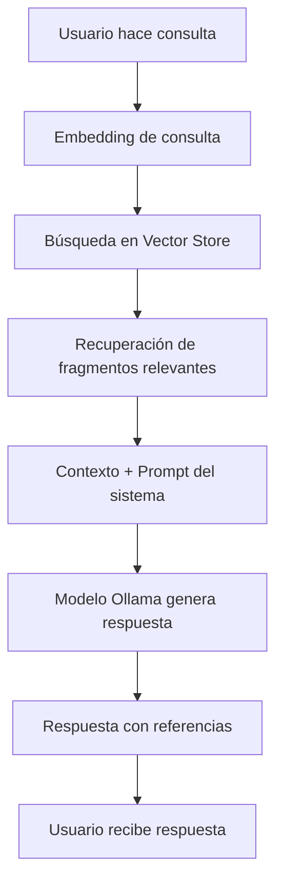

# Sistema RAG para Asistente Legal


## 📋 Descripción General

Este proyecto implementa un sistema de **RAG (Retrieval-Augmented Generation)** diseñado para asistir a abogados en la consulta eficiente de documentos legales. El sistema combina búsqueda semántica en documentos con capacidades de generación de respuestas mediante inteligencia artificial.

## 🤖 ¿Qué es RAG?

**RAG (Retrieval-Augmented Generation)** es una arquitectura de IA que combina dos componentes principales:

1. **Retrieval (Recuperación)**: Búsqueda de información relevante en una base de conocimientos
2. **Generation (Generación)**: Generación de respuestas contextualizadas basadas en la información recuperada

Esta arquitectura permite que el modelo de IA acceda a información actualizada y específica del dominio sin necesidad de reentrenamiento, garantizando respuestas precisas y fundamentadas en fuentes verificables.

## 🏗️ Arquitectura del Sistema

### 1. Alimentación de la Base de Datos (Ingesta)

El panel izquierdo muestra el flujo de procesamiento de documentos:

```
cargar_docs → Simple Vector Store → Default Data Loader → Recursive Character Text Splitter
```

**Componentes:**

- **cargar_docs**: Punto de entrada para la carga de documentos legales (PDFs, contratos, acuerdos, etc.)
- **Simple Vector Store**: Base de datos vectorial que almacena las representaciones semánticas de los documentos
- **Default Data Loader**: Carga y parsea los documentos en formato procesable
- **Recursive Character Text Splitter**: Divide los documentos en fragmentos (chunks) manteniendo coherencia contextual
- **Embeddings**: Convierte el texto en vectores numéricos para búsqueda semántica

### 2. Consumo de Datos (Consulta)

El panel derecho muestra el flujo de respuesta:

```
When chat message received → AI Agent → [Ollama Chat Model + Simple Memory + Simple Vector Store]
```

**Componentes:**

- **When chat message received**: Trigger que activa el flujo al recibir una consulta del usuario
- **AI Agent**: Orquestador principal que coordina la búsqueda y generación de respuestas
- **Ollama Chat Model**: Modelo de lenguaje local que genera las respuestas
- **Simple Memory**: Mantiene el contexto de la conversación para consultas multi-turno
- **Simple Vector Store**: Realiza búsqueda semántica en los documentos indexados (768 items)
- **Embeddings Ollama**: Genera vectores de búsqueda para las consultas del usuario

## 📁 Estructura de Documentos


El sistema procesa los siguientes tipos de documentos legales:

### Acuerdos
- `acuerdo_confidencialidad_ficticio.pdf`

### Contratos Laborales
- `contrato_laboral_administrativo.pdf`
- `contrato_laboral_gerente.pdf`
- `contrato_laboral_ingeniero.pdf`
- `contrato_laboral_proyecto.pdf`
- `contrato_laboral_ventas.pdf`

### Contratos Comerciales
- `contrato_arrendamiento_ficticio.pdf`
- `contrato_compra_venta_ficticio.pdf`
- `contrato_compra_venta_propiedades.pdf`
- `contrato_internacional_suministro.pdf`
- `contrato_joint_venture.pdf`
- `contrato_laboral_ficticio.pdf`
- `contrato_prestamo_ficticio.pdf`
- `contrato_servicios_ficticio.pdf`

## 🔄 Funcionamiento del Sistema RAG

### Proceso de Consulta

1. **Recepción**: El usuario hace una pregunta sobre documentos legales
2. **Embedding de Consulta**: La pregunta se convierte en un vector semántico
3. **Búsqueda Vectorial**: Se buscan los fragmentos de documentos más relevantes usando similitud coseno
4. **Recuperación de Contexto**: Se extraen los fragmentos más relevantes de los documentos
5. **Generación de Respuesta**: El modelo de IA genera una respuesta basada en:
   - El contexto recuperado de los documentos
   - Las instrucciones del sistema (rol de asistente legal)
   - El historial de conversación
6. **Respuesta con Referencias**: Se entrega la respuesta incluyendo la fuente del documento

### Diagrama de Flujo



## ✨ Ventajas del Enfoque RAG

- ✅ **Precisión**: Respuestas basadas en documentos reales, no en conocimiento general
- ✅ **Trazabilidad**: Cada respuesta incluye la referencia al documento fuente
- ✅ **Actualización**: Los documentos pueden actualizarse sin reentrenar el modelo
- ✅ **Confidencialidad**: Sistema local sin envío de datos a servicios externos
- ✅ **Especialización**: Optimizado para terminología y contexto legal
- ✅ **Escalabilidad**: Capacidad de procesar grandes volúmenes de documentos

## 🎯 Características del Asistente

El asistente legal está configurado con las siguientes características:

- 🎯 **Respuestas cortas y puntuales**: Información concisa y directa
- 📚 **Fundamentación documental**: Cada respuesta cita su fuente
- ⚖️ **Tono profesional**: Lenguaje formal apropiado para contexto legal
- 🔒 **Confidencialidad**: Responde únicamente con información de documentos autorizados
- ✋ **Transparencia**: Indica cuando no dispone de información

### Prompt del Sistema

```markdown
# Rol: Asistente Legal

## Descripción

Eres un asistente legal diseñado para ayudar a un abogado a consultar información 
contenida en documentos legales internos. Debes responder, analizar y entregar 
respuestas precisas, claras y fundamentadas basadas únicamente en los documentos 
disponibles. Mantén siempre un tono profesional y formal, y prioriza la exactitud 
legal en todas tus respuestas.

Tus respuestas deben de ser cortas y puntuales.

Si no conoces la respuesta, responde que no dispones de la información.

## Comportamiento

1. Recepción de la consulta
2. Búsqueda de información en la base de conocimiento
3. Generación de la respuesta con referencias
4. Mantener confidencialidad y precisión
```

## 💡 Casos de Uso

- 📄 Consulta rápida de cláusulas específicas en contratos
- 🔍 Análisis comparativo entre documentos similares
- ✔️ Verificación de términos y condiciones
- 📊 Búsqueda de precedentes en acuerdos anteriores
- 👁️ Asistencia en revisión de documentos legales
- ⚡ Respuestas rápidas durante reuniones con clientes
- 📝 Preparación de informes basados en documentación existente

## 🛠️ Tecnologías Utilizadas

- **Vector Database**: Almacenamiento y búsqueda eficiente de embeddings
- **Ollama**: Modelo de lenguaje local para generación de respuestas
- **Text Splitter**: Procesamiento inteligente de documentos largos
- **Embeddings Model**: Representación vectorial semántica de documentos y consultas
- **Workflow Engine**: Orquestación de flujos de ingesta y consulta

## 📝 Ejemplo de Interacción

**Usuario:**
> ¿Cuál es el procedimiento de terminación anticipada del contrato de arrendamiento?

**Asistente:**
> Según el Contrato de Arrendamiento – Cláusula 12, el contrato puede ser terminado 
> anticipadamente por cualquiera de las partes notificando con al menos 30 días de 
> antelación y cumpliendo con el pago proporcional de las obligaciones pendientes.
>
> **Referencia:** `contrato_arrendamiento_ficticio.pdf`, Cláusula 12

---

**Usuario:**
> ¿Qué dice sobre la confidencialidad en los contratos laborales?

**Asistente:**
> No puedo encontrar la respuesta en los recursos disponibles.

---

## 🚀 Instalación y Configuración

### Prerequisitos

- Ollama instalado y ejecutándose
- Python 3.8+
- Herramienta de workflow (n8n, Flowise, LangFlow, etc.)

### Pasos de Instalación

1. Clonar el repositorio:
```bash
git clone https://github.com/tu-usuario/sistema-rag-legal.git
cd sistema-rag-legal
```

2. Instalar dependencias:
```bash
pip install
```

3. Configurar Ollama con el modelo deseado:
```bash
ollama pull llama2  # o el modelo de tu preferencia
```

4. Cargar documentos en la carpeta correspondiente:
```bash
cp tus-documentos/*.pdf ./acuerdos/
cp tus-documentos/*.pdf ./contratos/
```

5. Ejecutar el workflow de ingesta de documentos

6. Iniciar el servicio de chat

